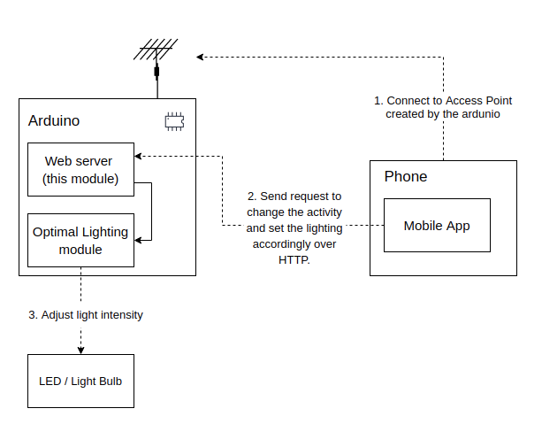

# Smart and connected lighting - Ardunio Web Server

The following module is a Web Server for the ardunio written in C++.<br><br>
The module relies on the following two ardunio libraries:
- WiFiNINA
- ArduinoJson
<br>

Make sure to install them before compiling.<br><br>

## Default Config

Access Point SSID: SMART_AND_CONNECTED_LIGHTING_AP<br>
Access Point Password: [f/%ua/8aMG8S<6e<br>
Access Point IP Address: 10.10.10.10<br>
Web Server Port: 80<br>
<br><br>

## How to send commands to the web server?

This is already done by my mobile application. No need to develop your own library!<br>
Nevertheless, you may find below a list of the web server endpoints that are available and how to use them.
<br><br>

- POST /action
    ```
    Goal: optimize the lighting for the specified duration and action

    Endpoint URL: /action
    Method: GET
    Query Params: none
    Body Params:
        - action: the action the user wants to set (ex: COOKING, READING, etc...)
        - durationInMinutes: the duration during which the lighting should be changed according to the action

    Example Post Body:
    {
        "action": "EATING",
        "durationInMinutes": "30"
    }

    Success Response:
    {
        "status": "success"
    }

    Error Response:
    {
        "status": "failure"
    }
    ```
- GET /intensity
    ```
    Goal: get the current intensity of the LED / BULB in lux

    Endpoint URL: /intensity
    Method: GET
    Query Params: none
    Body Params: none

    Success Response:
    {
        "status": "success",
        "intensity": "500",
        "unit": "lux"
    }

    Error Response:
    {
        "status": "failure"
    }
    ```
- GET /action
    ```
    Goal: get the current action (if any)

    Endpoint URL: /action
    Method: GET
    Query Params: none
    Body Params: none

    Success Response:
    {
        "status": "success",
        "action": "COOKING"
    }

    Error Response:
    {
        "status": "failure"
    }
    ```

<br>
Once again, the communication between the server and the mobile app is already done.<br>
You do not need to develop your own library!<br>
<br>

## What does this module do?

This module is the central piece of the smart and connected lighting project, it enables the app to set the action the user wants to do to then set the optimal lighting by using the library developed by the rest of the team.<br><br>



